# 一箭又一箭

使用 Python + pygame 开发的“一箭又一箭”风格点击式箭头解谜小游戏（软件工程第二次个人作业）。

## 游戏简介

棋盘中散布着朝上（↑）、下（↓）、左（←）、右（→）四个方向的箭头。玩家点击某个箭头后，程序会检查该箭头前进方向上直到棋盘边界之间是否还有其他箭头：

- **前方无阻挡**：箭头飞出棋盘并被消除；
- **前方有阻挡**：箭头不能消除，会晃动并提示碰撞，同时消耗 1 次失误机会；
- **清空本关全部箭头**：通关，进入下一关；
- **失误次数耗尽**：本关失败，可重新开始。

游戏包含 **5 个关卡**，箭头密度逐级增大（从 9 个到 30 个，最后一关 8×8 接近铺满棋盘），后两关失误次数降为 2 次，难度逐步提升。第 1 关为手工设计的新手关，第 2~5 关由 `tools/generate_level.py` 随机生成（逆向构造法，保证可通关），方向完全打散，不会出现“一整行同一方向”的规律布局。所有关卡均通过可解性求解器校验。

**每关限时**：HUD 显示剩余秒数（≤10 秒变红），超时未通关则本关失败；**通关后按“用时 + 失误次数”评定 1~3 颗星**，全部通关界面显示总星数（满分 15 星）。

## 关卡难度表

| 关卡 | 棋盘 | 箭头数量 | 依赖深度* | 失误次数 | 限时（秒） |
| --- | --- | --- | --- | --- | --- |
| 第 1 关 | 5×5 | 9 | 3 | 3 | 40 |
| 第 2 关 | 6×6 | 16 | 3 | 3 | 55 |
| 第 3 关 | 6×6 | 18 | 5 | 3 | 60 |
| 第 4 关 | 7×7 | 22 | 5 | 2 | 75 |
| 第 5 关 | 8×8 | 30 | 6 | 2 | 90 |

\* 依赖深度：按“可消除的箭头一批批消除”的贪心模拟轮数，数值越大说明必须按顺序消除的链条越长、越考验规划。

## 评分规则

通关后按“用时 + 失误次数”评定 **1~3 颗星**（满分 15 星，全部通关界面显示总星数）：

| 条件 | 星级 |
| --- | --- |
| 无失误，且用时 ≤ 限时的 60% | ★★★ |
| 失误 ≤ 1 次，且用时 ≤ 限时的 85% | ★★ |
| 其余情况（通关即有 1 星） | ★ |

判定顺序：星级 = `max(1, 3 - max(时间分, 失误分))`，其中时间分 = 用时占比 ≤60%→0、≤85%→1、否则→2；失误分 = 失误 0 次→0、1 次→1、≥2 次→2。限时耗尽则本关失败（超时失败与失误耗尽同样进入失败界面）。

## 开发环境

| 项目 | 说明 |
| --- | --- |
| 操作系统 | Windows 10/11 |
| Python | 3.10+（开发使用 3.12） |
| 图形库 | pygame 2.1+（开发使用 2.6.1） |
| 测试 | 标准库 unittest（无需额外安装） |

## 安装和运行方法

```bash
# 1. 安装依赖（只需 pygame）
pip install -r requirements.txt

# 2. 运行游戏
python main.py
```

运行测试（可选）：

```bash
python -m unittest discover -s tests -v
```

## 游戏操作说明

- **开始界面**：点击“开始游戏”进入第 1 关；
- **游戏界面**：鼠标左键点击棋盘中的箭头；
  - 顶部显示：当前关卡、剩余箭头数量、剩余失误次数（红心）、剩余时间（≤10 秒变红）、重新开始按钮；
  - 箭头成功飞出时会有滑出动画；
  - 点击被阻挡的箭头时，箭头晃动、出现红色提示文字，失误次数减 1；
- **通关界面**：显示用时、失误与评定的 1~3 颗星，点击“下一关”继续；
- **失败界面**：失误次数耗尽或限时耗尽都会失败，点击“重新开始”恢复本关初始状态；
- **全部通关后**：显示总星数（满分 15 星），点击“返回首页”回到开始界面。

## 游戏流程

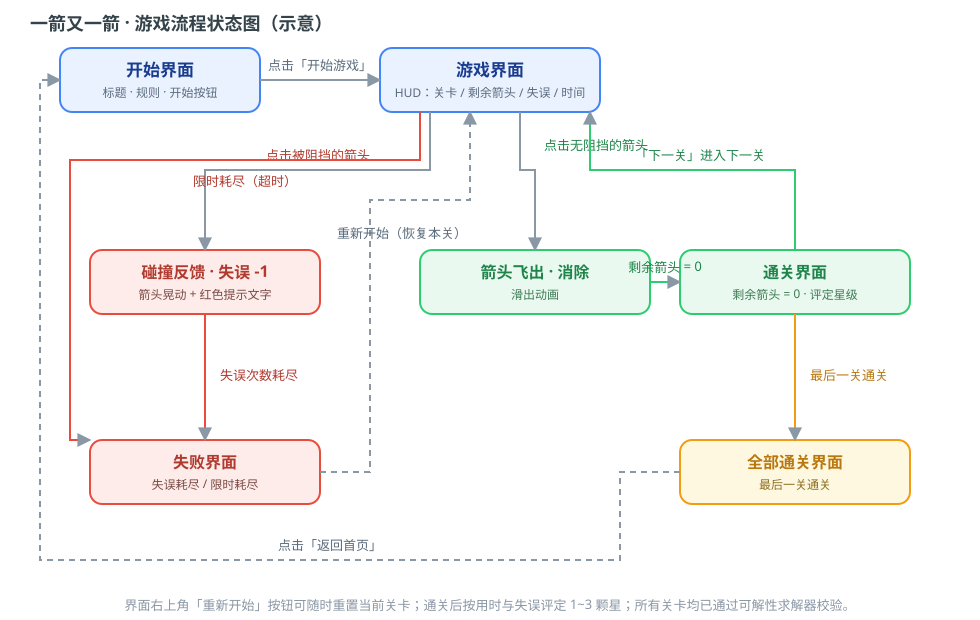

## 游戏截图

### 开始界面


### 游戏界面（第 1 关）

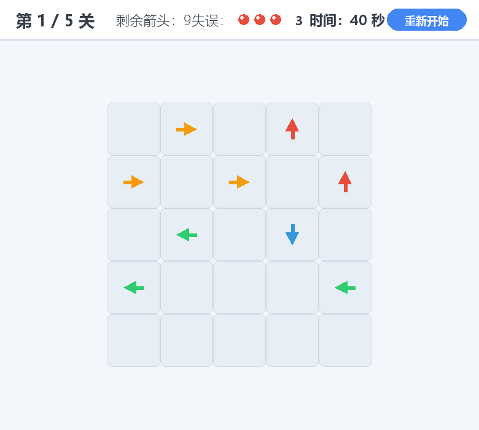

### 随机生成的关卡（第 2 关，16 个箭头）

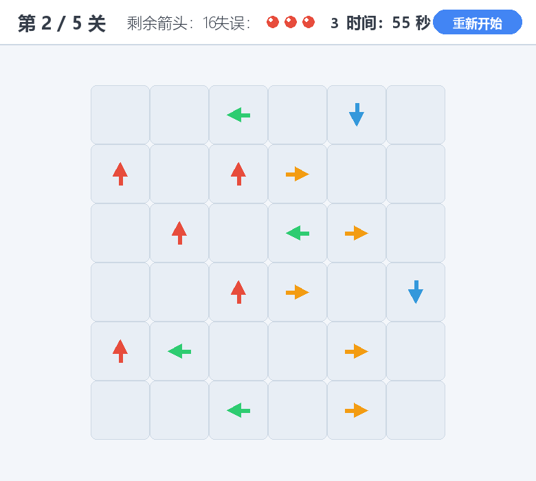

### 高难度关卡（第 5 关，8×8 共 30 个箭头）

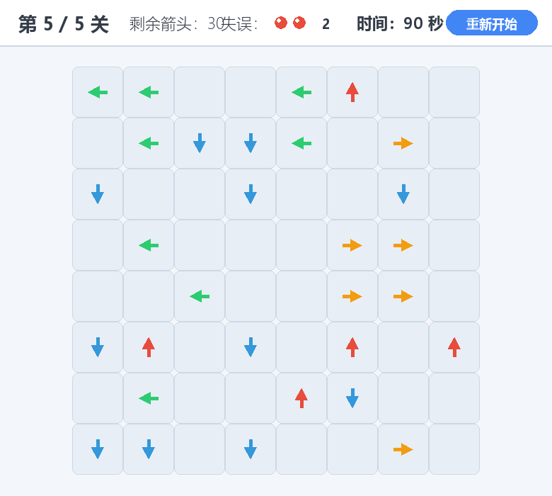

### 碰撞反馈（失误 -1）

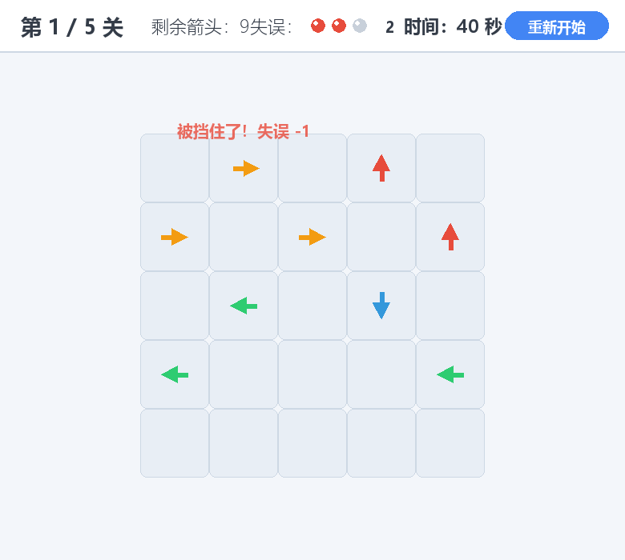

### 箭头飞出动画

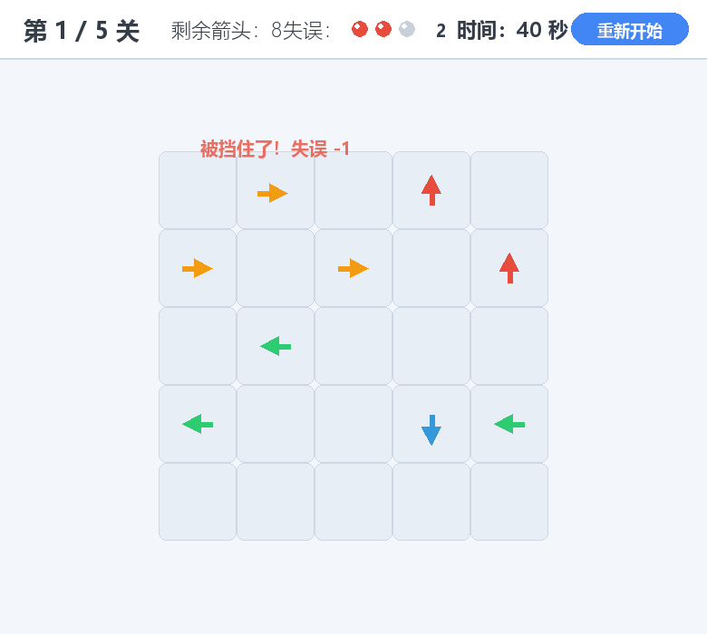

### 通关界面

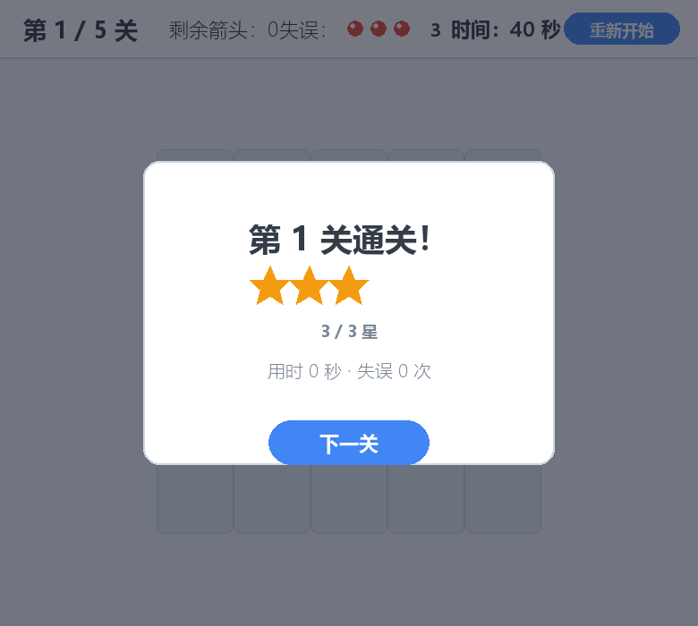

### 失败界面

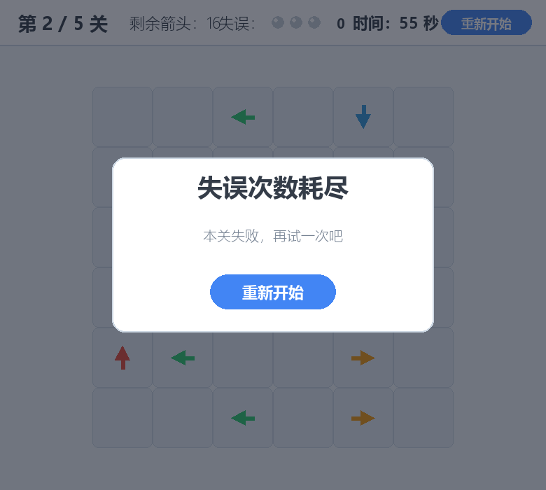

### 超时界面（限时耗尽）

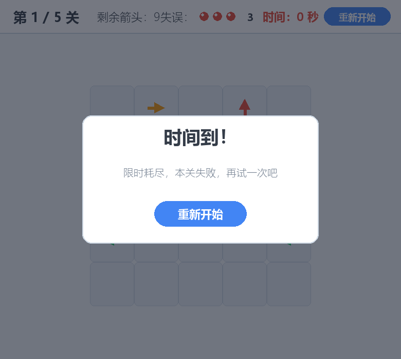

### 全部通关（显示总星数）

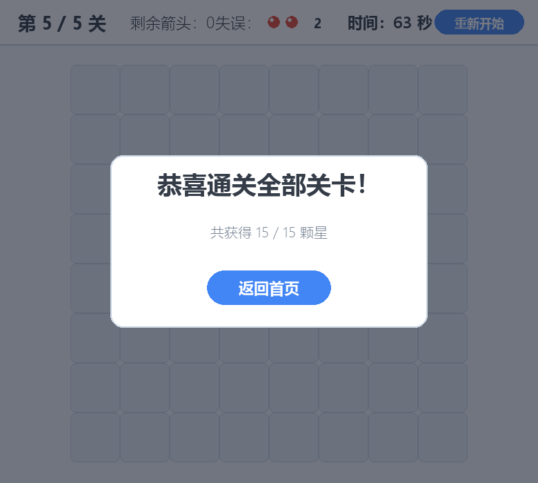

### 演示 GIF

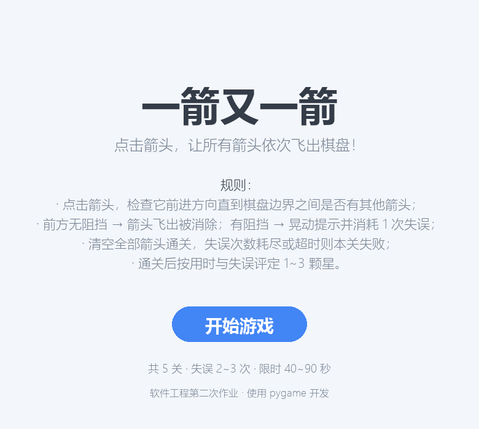

## 项目结构

```
arrow-game/
├── main.py               # 游戏入口：pygame 界面、动画、主循环
├── game.py               # 核心逻辑：棋盘、路径检测、点击处理、关卡状态机、可解性求解器
├── levels.py             # 关卡数据（5 个已校验可通关的关卡，难度递增）
├── requirements.txt      # 依赖
├── README.md
├── tests/
│   └── test_game.py      # 自动化测试（覆盖作业要求 T01-T06 及评分 T07-T12 等 28 个用例）
├── tools/
│   ├── generate_level.py     # 随机生成可通关关卡（附加功能）
│   ├── make_screenshots.py   # 无窗口生成各界面截图
│   └── make_demo_gif.py      # 自动演示并录制 GIF
└── screenshots/          # 截图与演示 GIF
```

## 说明

- 本项目仅参考微信小游戏《一箭又一箭》的核心玩法，未使用原游戏的代码、美术素材、音效或关卡；
- 全部图形均由 pygame 基本图形绘制，无第三方美术资源，不涉及版权问题；
- 开发过程使用 AIGC 工具（豆包 Doubao）辅助完成，记录详见博客。
